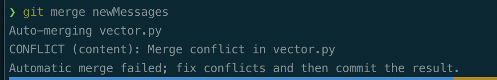
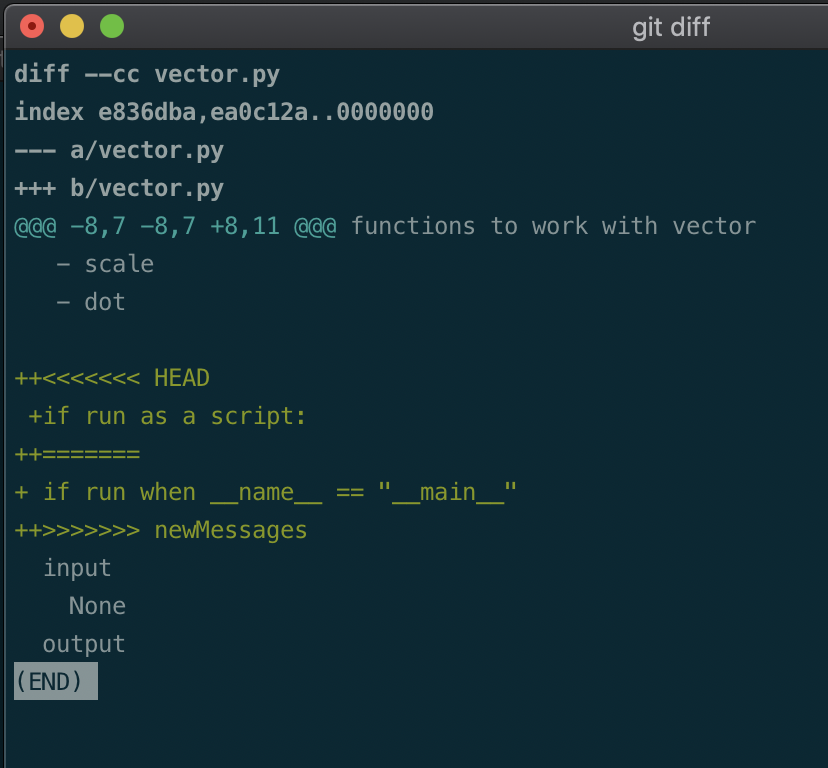
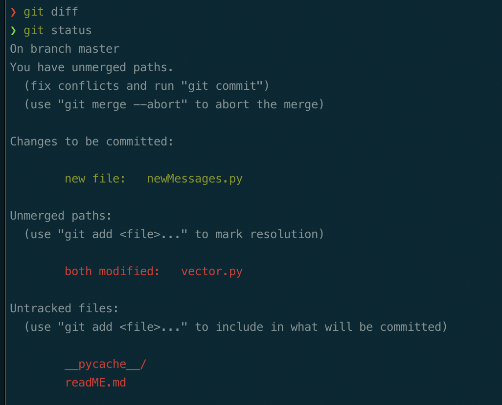
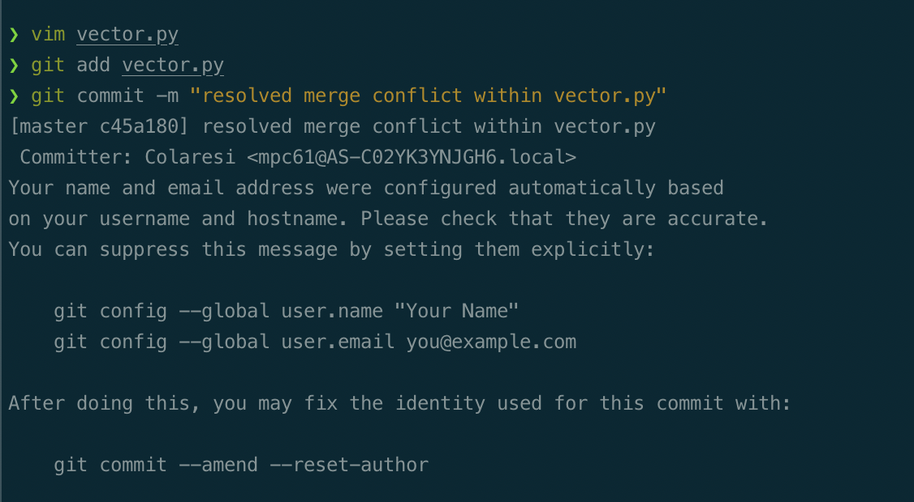

This directory includes files to explore a merge conflict.

There is a git history of commits to build out a project that has:

1. vector.py -- a module that includes functions to work with vectors, it also includes some functionality for testing to make sure the functions are working properly

2. addMessages.py -- a short script that inputs two messages as vectors and uses vector.add() to add them. It then prints the answer

3. runTests.sh -- a shell script that will run the tests in vector.py to ensure it is working

4. Makefile -- a make file that will run addMessages by default. It was also produce the output of the vector.py tests with the explicit TEST target

5. readMe.md -- this file

6. .git -- the git history is stored, it includes work on only one branch


On the newMessages branch, there is also a new file, called newMessages.py.

# An example of a merge conflict

Merge conflict occur when you attempt to merge a commit in one branch to another branch but there are conflicting changes.
 This means that there are places in the code where the information is contradictory. 
Usually, the conflict is identified at the line-level.
A line in a file has changes in two different places, so git does not know which version is the best one for the post-merge commit.

This can be as innocuous as a misplaced space or as difficult as several functions that were written very differently across the branches.

Using branches to work on specific features, and merging back into the main branch frequently can avoid hard to handle merge conflicts.

It is important to point out that merge conflicts happen in many projects and never go detected, especially when version control is not used.
A researcher works on one version of a file and saves it.
Then picks up the file later, saving and naming it differently. 
After that, it can be the case that the researchers begins work a third time on the first file and not the second.
Perhaps the naming conventions were not quite right or they forgot what conventions they were using. 
At some point the researcher may realizes that the work that led to the second, orphaned file, has not been included in this third and forth version.
If some of the changes in the third and fourth version were on the same parts of the file that the second version changes... we have a merge conflict.
On the other hand, the researcher may never realize in this case that they have a merge conflict, because they never go back and merge. 
Worse, they might write up their analysis assuming they did the work in version two, but that was never included in the pipeline.
The flagging of merge conflicts is a great thing and they are usually not so hard to fix.

## A sample merge conflict with git

In this repo, we have two branches, master and newMessages.

On the newMessages branch, there is a new file newMessages.py as well as changes to the docstring in vector.py, in comparison to the master branch.

Before the new Messages branch was merged back into the master branch, the researcher switched back to the master branch and made some other changes to vector.py.

In their defense there was a conference coming up, and they wanted to present their best  and most stable work, which was on the master branch. 

This conference commit, on master, is tagged as commit v1.0.

## The coming conflict

After the conference, it is clear from the comments that the team needs to add more messages and so they want to merge in the newMessage branch to master/main.

This is where you come in. After cloning this repository, check that you are on the master branch, and try and merge in the changes from the newMessages branch with the comment:

```zsh
git merge newMessage

```

This should throw a message about a merge conflict. 

It will look something like this:



Do not panic. Git has identified exactly where in the file there is a conflict. First run git diff to take a look:

```zsh
git diff

```

You should see this:



This is great. Git has changed the version of vector.py in the working directory on master, to identify the lines that have a conflict. 

Git diff by default shows 3 lines of context above and below a change. Positive signs are addition. 

The "<<<<<<<<< HEAD" tells us what text in in the current HEAD that we are looking at, what is on master here. 

"=========" is like the dividing line. Above this is the HEAD version of the line, below this is the alternative version. 

From the ">>>>>>> newMessages" we can see that the alternative version of vector.py in new messages had a different line here.

In addition, the "@@@ -8,7" tells you where in the first vector.py version the output starts. The difference starts at line 11, because of the 3 lines of context above, 8+3=11. 
Pressing q to exit from the git diff view. We can next check git status. 

```zsh
git status

```

The output should look something like this:



Helpfully, we are told a little bit about what is going on.

The solution is to fire up vim, and edit the working version of the file that has the merge conflict, vector.py. 

When you do that you will see the "<<<<<" and ">>>>" anotations. 

Just edit the file to get rid of those annotation and either pick the line version above the "====", deleting the other, and the "===="; pick the version below the "====", again deleting everything else; or deleting both versions, as well as the annotations and writing a new message, and adding some other text to take the place of either line version.

This is **resolving** a merge conflict. It is simply picking which version of a particular line should be kept. In this case some combination of the two is probably best. Change it how you see fit. Write your changes out and quit vim.

Importantly: the file should now look how you want it to look, you do not want git added merge annotations "<<<<", "====", ">>>>". 

```zsh
git add vector.py
git commit -m "resolved merge conflict with vector.py"

```

You should then see a message like this



You have resolved a merge conflict.

## Rewinding

If you want to try this activity *again* from the beginning, you can rewind back to the conflict. 

```zsh
git reset --hard PUT_HASH_WHERE_YOU_WANT_TO_RESET_TO_HERE

```

In this case because the conference commit is tagged as v2.0, we can just:

```zsh
git reset --hard v2.0 

```

To check for the hash of the commit you want, you can use git log or git hist.

Note that the commits you are rewinding behind are not gone/deleted right away.
However, since they are now no attached, they will be garbage collected, so only do this if you really do not care about the future commits as in this short example.


